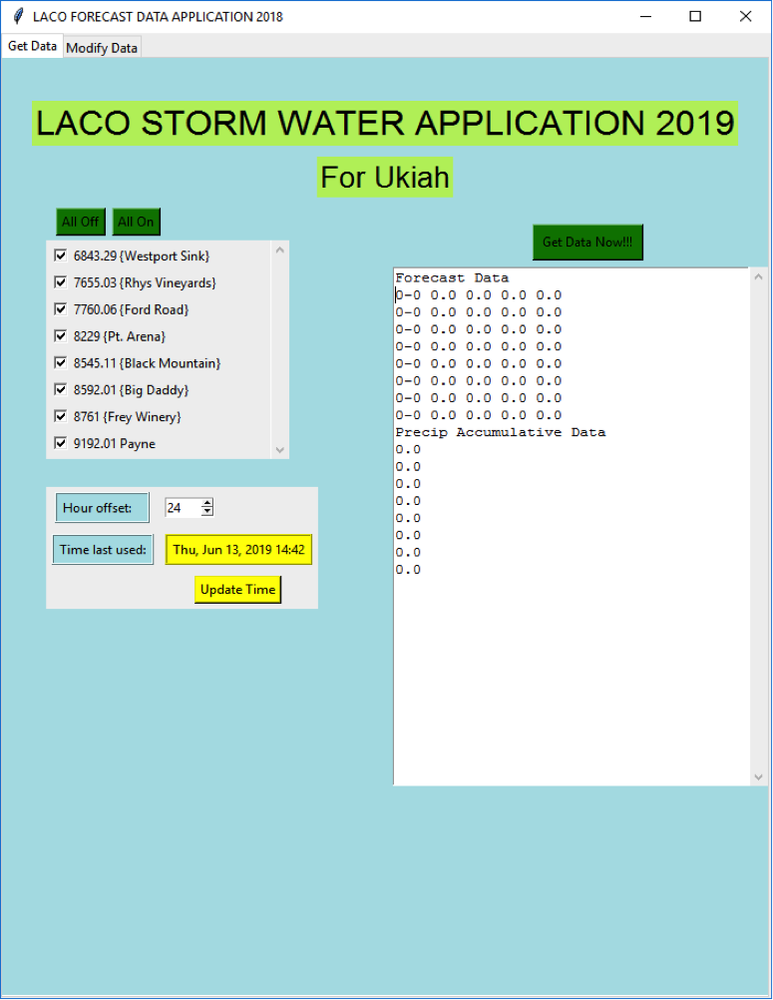
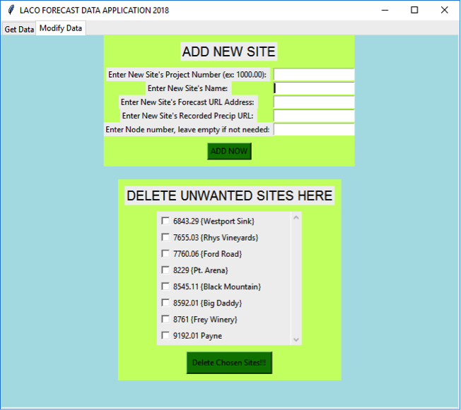
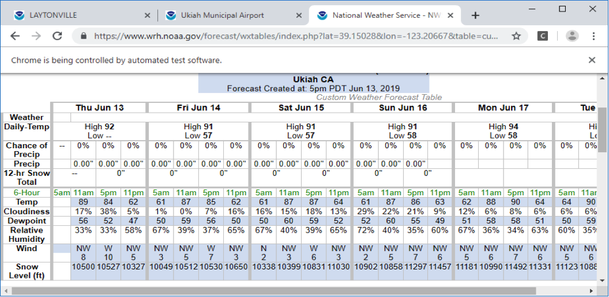

# Forecast-Data-Application---Python
This web-scraping application utilizes selenium, requests, tkinter to create an interactive program that allow users to collect precipitation data from various locations at once.
### Video: https://www.youtube.com/watch?v=KQjXdQZ2hEo&t=2s
### More detail documentation: Forecast Data Procedure.docx

Example: 

Example:

Example:

